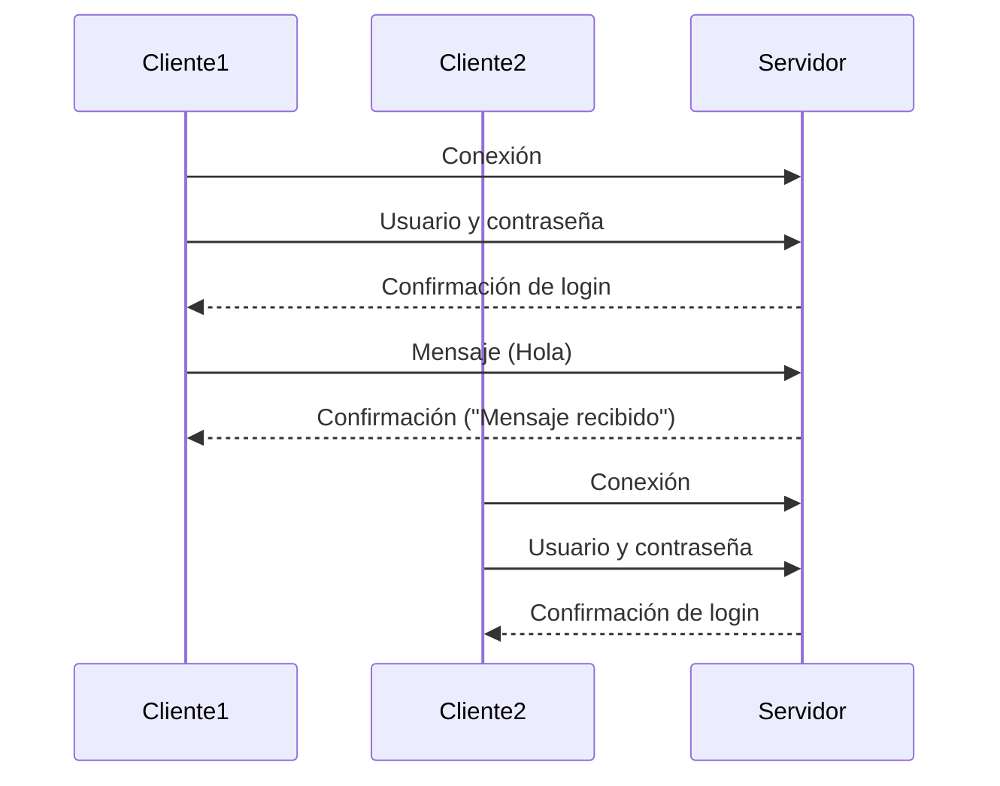

# Simulación Cliente-Servidor

Este proyecto incluye una simulación de red cliente-servidor utilizando Python y sockets TCP. El objetivo es proporcionar una base académica para entender el modelo cliente-servidor, el protocolo TCP y la comunicación concurrente.

## Modelo Cliente-Servidor

El modelo cliente-servidor es una arquitectura de red donde los clientes solicitan servicios o recursos, y el servidor los proporciona. En este caso, los clientes interactúan con el servidor enviando solicitudes y recibiendo respuestas a través de sockets TCP.

## Protocolo de Comunicación: TCP

El protocolo TCP (Protocolo de Control de Transmisión) ofrece un flujo de datos confiable y ordenado entre clientes y servidores. Utilizamos este protocolo debido a su capacidad para garantizar la entrega sin pérdidas de datos.

## Características

- Comunicación mediante sockets TCP.
- Autenticación de clientes mediante usuario y contraseña.
- Simulación de envío de mensajes entre cliente y servidor.
- Confirmación de recepción de mensajes.
- Soporte para múltiples clientes simultáneamente usando `threading`.

## Requisitos

- Python 3 instalado.
- Librerías estándar (`socket`, `threading`).

## Estructura del Proyecto
```
simulacion-cliente-servidor/
├── server.py        # Código del servidor
├── client.py        # Código del cliente
├── README.md        # Documentación
└── docs/            # Documentación adicional (opcional)
```

## Instrucciones

### Crear un entorno virtual (opcional)
Es recomendable trabajar en un entorno virtual:
```bash
python3 -m venv venv
source venv/bin/activate  # Para Linux/Mac
venv\Scripts\activate    # Para Windows
```

### Ejecutar el servidor
En una terminal, inicie el servidor con:
```bash
python3 server.py
```

### Ejecutar el cliente
En dos terminales diferentes, inicie los clientes con:
```bash
python3 client.py
```

## Ejemplo de flujo de comunicación
1. Iniciar el servidor.
2. Cada cliente se conecta al servidor.
3. El cliente envía credenciales (usuario: `cliente1`, contraseña: `password1`).
4. Si el login es exitoso:
    - El cliente puede enviar mensajes.
    - El servidor confirma recepción.
5. Si el cliente escribe `salir`, se desconecta.

## Diagrama de Flujo



## Notas Importantes

- Los usuarios y contraseñas están definidos en el archivo `server.py`.
- El cliente puede desconectar la sesión escribiendo `salir` en la terminal.
- Para una prueba funcional, se recomienda usar dos terminales para clientes distintos.
