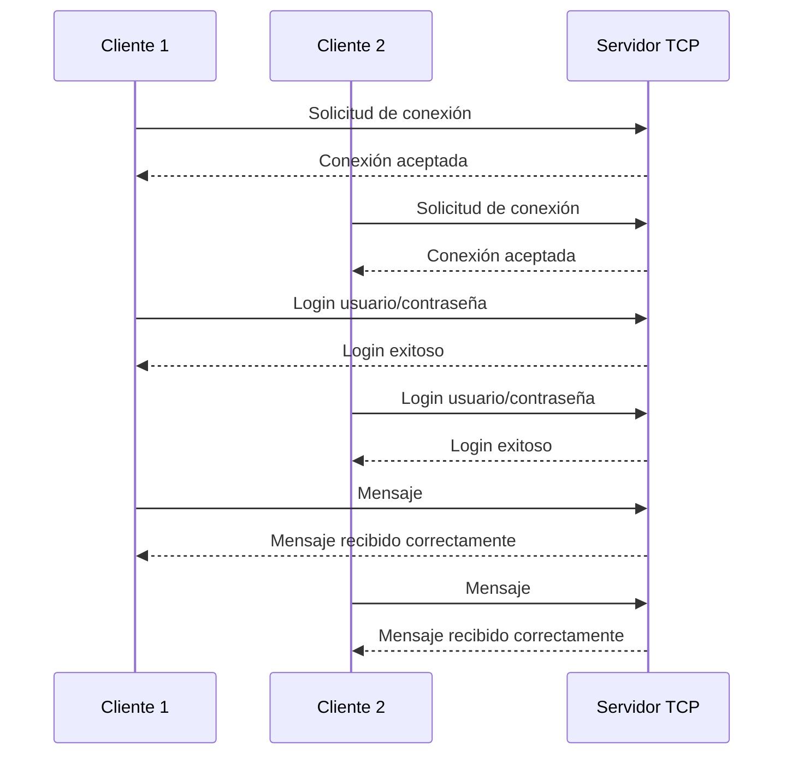

# Simulación de Red Cliente-Servidor en Python

Proyecto en Python que simula una red cliente-servidor usando sockets TCP, autenticación básica, envío de mensajes, confirmación de recepción y manejo de múltiples clientes simultáneos mediante `threading`.

## Tecnologías utilizadas

- Python 3.11+
- socket
- threading
- logging
- json
- datetime
- os
- pytest opcional para pruebas

## Arquitectura general

```text
project-root/
├── app/
│   ├── server/
│   ├── client/
│   └── common/
├── docs/
├── logs/
├── tests/
├── screenshots/
├── requirements.txt
├── README.md
├── .gitignore
├── run_server.py
└── run_client.py
```

## Modelo cliente-servidor

El modelo cliente-servidor divide el sistema en dos partes principales:

- **Servidor:** espera conexiones, autentica usuarios, recibe mensajes y envía respuestas.
- **Cliente:** se conecta al servidor, inicia sesión y envía mensajes.

En esta simulación, el servidor puede atender varios clientes al mismo tiempo gracias al uso de hilos.

## Protocolo TCP

TCP es un protocolo orientado a conexión. Esto significa que antes de enviar datos, cliente y servidor establecen una conexión confiable. En este proyecto se usa TCP porque garantiza que los datos lleguen en orden y permite una comunicación estable entre dispositivos.

## Sockets

Un socket es un punto de comunicación entre dos programas en una red. El servidor crea un socket, lo asocia a una dirección y puerto, y queda escuchando conexiones. El cliente crea otro socket y se conecta a esa dirección.

## Diagrama Mermaid del flujo



## Crear entorno virtual

### Windows PowerShell

```bash
python -m venv venv
.\venv\Scripts\Activate.ps1
```

Si PowerShell bloquea la activación:

```bash
Set-ExecutionPolicy -Scope CurrentUser RemoteSigned
```

### Windows CMD

```bash
python -m venv venv
venv\Scripts\activate
```

### Linux

```bash
python3 -m venv venv
source venv/bin/activate
```

### macOS

```bash
python3 -m venv venv
source venv/bin/activate
```

## Instalar dependencias

```bash
pip install -r requirements.txt
```

## Ejecutar servidor

Desde la raíz del proyecto:

```bash
python run_server.py
```

Salida esperada:

```text
Servidor iniciado en 127.0.0.1:5000
Esperando conexiones de clientes...
```

## Ejecutar dos clientes simultáneos

Abre dos terminales diferentes, activa el entorno virtual en cada una y ejecuta:

```bash
python run_client.py
```

Usuarios de prueba:

| Usuario | Contraseña |
|---|---|
| cliente1 | 1234 |
| cliente2 | abcd |
| admin | admin123 |

## Ejemplo de uso

Cliente:

```text
Conectado al servidor 127.0.0.1:5000
Usuario: cliente1
Contraseña: ****
Servidor: Login exitoso
Mensaje: Hola servidor
Servidor: Mensaje recibido correctamente
Mensaje: salir
Servidor: Conexión cerrada
```

Servidor:

```text
Cliente conectado: 127.0.0.1:54321
Usuario autenticado: cliente1
Mensaje recibido de cliente1: Hola servidor
Confirmación enviada a cliente1
Usuario salió: cliente1
```

## Ejecutar pruebas

```bash
pytest
```

## Configuración por variables de entorno

Puedes cambiar host y puerto así:

### Linux/macOS

```bash
export SERVER_HOST=127.0.0.1
export SERVER_PORT=6000
python run_server.py
```

### Windows PowerShell

```bash
$env:SERVER_HOST="127.0.0.1"
$env:SERVER_PORT="6000"
python run_server.py
```

