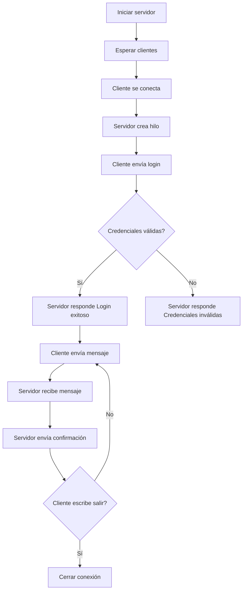

# Flujo de Comunicación Cliente-Servidor

## 1. Inicio del servidor

El servidor se ejecuta en `127.0.0.1:5000` por defecto. Crea un socket TCP, se asocia al host y puerto, y queda esperando conexiones.

## 2. Conexión del cliente

El cliente crea un socket TCP y solicita conexión al servidor.

## 3. Creación de hilo

Cuando el servidor acepta un cliente, crea un hilo independiente para atenderlo. Esto permite que otros clientes también se conecten.

## 4. Login

El cliente solicita usuario y contraseña desde consola. Luego envía un mensaje JSON de tipo `login`.

Ejemplo:

```json
{
  "type": "login",
  "payload": {
    "username": "cliente1",
    "password": "1234"
  }
}
```

## 5. Validación

El servidor compara las credenciales con un diccionario simulado ubicado en `auth.py`.

Respuestas posibles:

```text
Login exitoso
Credenciales inválidas
```

## 6. Envío de mensajes

Si el login es correcto, el cliente puede enviar mensajes al servidor.

Ejemplo:

```json
{
  "type": "message",
  "payload": {
    "text": "Hola servidor"
  }
}
```

## 7. Confirmación de recepción

El servidor responde:

```text
Mensaje recibido correctamente
```

## 8. Cierre de conexión

Si el usuario escribe `salir`, el cliente envía un mensaje de tipo `exit`. El servidor confirma y cierra la conexión.

## Diagrama Mermaid


